# Laboratório Prático - Git e GitHub

Este laboratório prático tem como objetivo ajudar você a exercitar as principais funcionalidades do Git e GitHub, como criação de repositórios, adição de arquivos, commits, push, pull e gerenciamento de branches.

---

## 1. Configuração Inicial do Git

Antes de começar, configurei meu nome e e-mail no Git utilizando os comandos indicados na atividade.

**📸 Print da configuração do Git:**
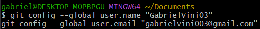

---

## 2. Criar um Repositório Local

Criei uma nova pasta para o projeto, entrei nela e inicializei um repositório Git local.

**📸 Print da criação do repositório local:**
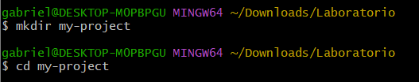  
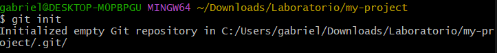

---

## 3. Adicionar Arquivos e Fazer Commit

Criei o arquivo `README.md`, verifiquei o status do repositório, adicionei o arquivo à área de staging e realizei o primeiro commit.

**📸 Print das ações de criação, status, add e commit:**
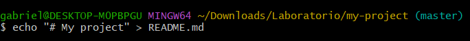

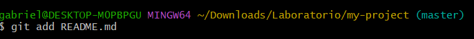
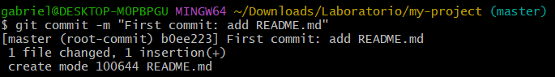

---

## 4. Criar um Repositório no GitHub

Acessei o GitHub, criei um repositório chamado `meu-projeto`, deixei público e não adicionei nenhum arquivo durante a criação. Copiei a URL do repositório.

**📸 Print da criação do repositório no GitHub:**
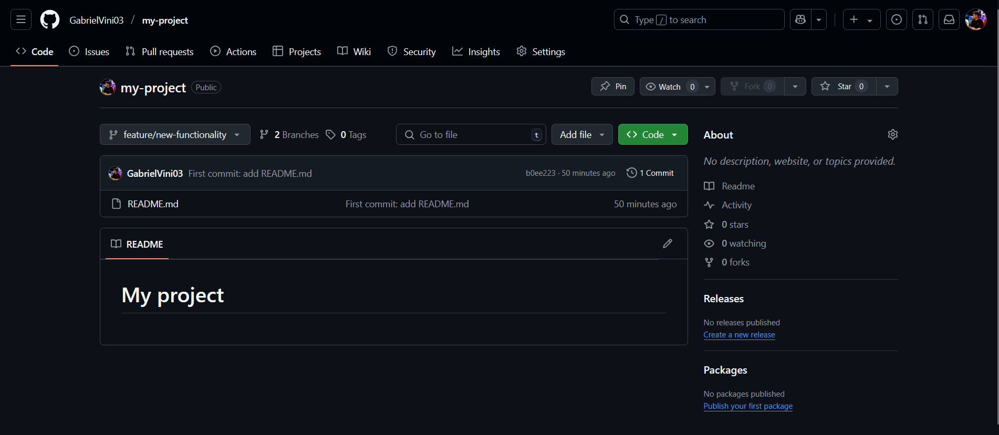

---

## 5. Conectar o Repositório Local ao GitHub

Adicionei o repositório remoto ao meu projeto local e fiz o primeiro `push`. Durante esse processo, utilizei um token de autenticação pessoal gerado no GitHub.

**📸 Print da conexão com o repositório remoto e push:**
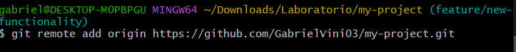
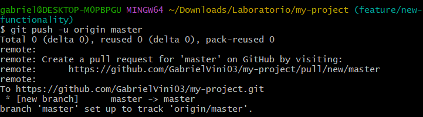

---

## 6. Criar e Trabalhar em uma Nova Branch

Criei uma branch chamada `feature/nova-funcionalidade`, adicionei um novo arquivo com uma mensagem de teste, fiz o commit e enviei a branch ao GitHub.

**📸 Print da criação da branch e envio ao 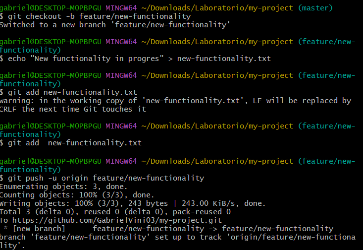

---

## 7. Fazer Merge da Branch na Main

Voltei para a branch `main`, atualizei as informações, fiz o merge da branch `feature/nova-funcionalidade` e enviei as alterações para o GitHub.

**📸 Print do merge da nova branch com a main:**
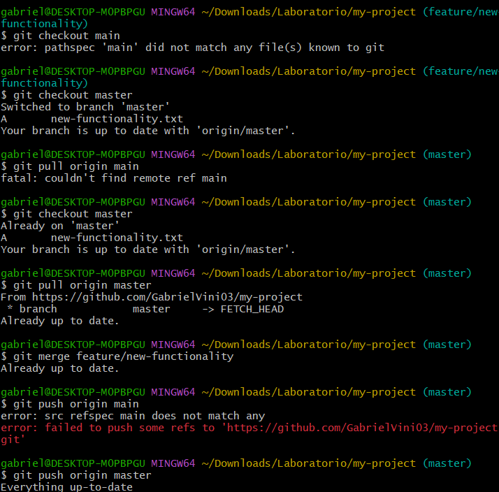
